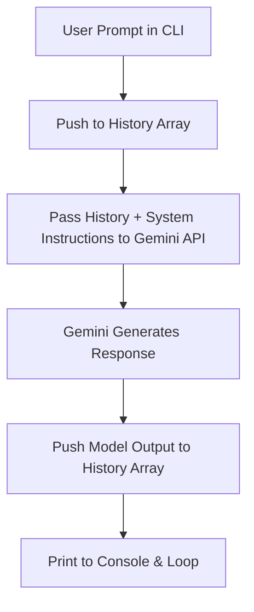

<div align="center">

# 🤖 Chatbot on Custom Chats

### An intelligent conversational AI chatbot powered by Google Gemini and custom persona-driven system instructions.

[](https://nodejs.org/)
[](https://ai.google.dev/)
[](https://developer.mozilla.org/)
[](LICENSE)

<br/>

</div>

---

## 📖 Overview

**Chatbot on Custom Chats** is a personalized conversational agent built with Node.js and Google's official `@google/genai` SDK. It leverages few-shot context and dialogue examples from [`chaat.js`](./chaat.js) as system instructions, allowing the model to emulate realistic tones, personalities, and conversational dynamics while maintaining multi-turn context memory.

---

## ✨ Features

- 🧠 **Context-Aware Multi-Turn Conversations:** Dynamically tracks conversation history across multiple turns without losing context.
- 🎭 **Custom Persona & System Instructions:** Injects conversational chat history and instructions to shape tone, humor, and style.
- ⚡ **High-Speed Model:** Uses Google's `gemini-3.5-flash-lite` for low-latency, real-time responses.
- 🛡️ **Defensive Error Handling:** Built-in safeguards against empty inputs, API rate limits, and missing credential errors.
- 🔒 **Secure Configuration:** Environment-variable based credentials with auto-path resolution to prevent key leaks.

---

## 🛠️ Tech Stack

| Technology | Purpose |
| :--- | :--- |
| **Node.js** | JavaScript runtime environment |
| **@google/genai** | Official Google GenAI SDK |
| **readline-sync** | Synchronous interactive CLI user input |
| **dotenv** | Secure environment configuration management |

---

## 📂 Project Structure

```text
ChatBOT_Anjali/
├── .env.example          # Template for environment variables
├── .gitignore            # Protects keys & node_modules from being pushed
├── chaat.js              # Reference conversation dataset & system prompt
├── girl.js               # Main chatbot entry point and execution loop
├── package.json          # Project metadata, dependencies, and scripts
└── README.md             # Project documentation
```

---

## 🚀 Getting Started

### 1. Prerequisites

- [Node.js](https://nodejs.org/) (version 18 or higher recommended)
- A Google Gemini API key from [Google AI Studio](https://aistudio.google.com/)

### 2. Clone the Repository

```bash
git clone https://github.com/kanishk3114S/chatbot_on_customChats.git
cd chatbot_on_customChats
```

### 3. Install Dependencies

```bash
npm install
```

### 4. Setup Environment Variables

Create a `.env` file in the project root:

```bash
cp .env.example .env
```

Open `.env` and add your Gemini API key:

```env
GEMINI_API_KEY=your_actual_gemini_api_key_here
```

### 5. Start the Chatbot

You can run the chatbot using either npm or Node directly:

```bash
npm run dev
```

*or*

```bash
node girl.js
```

---

## 💬 Usage Example

```text
=== Chatbot started! (Type 'exit' to quit) ===

Start the chat -----> Bro are you awake?

Gemini: Unfortunately yes. Why are you messaging me at 2 AM?

Start the chat -----> Just thinking about life.

Gemini: Classic move. That's when life becomes 10x more confusing. Did you at least make some Maggi?

Start the chat -----> exit

Bye! Have a nice day.
```

---

## ⚙️ How It Works



1. **Input Capture:** `readlineSync` reads the user's input directly from the CLI terminal.
2. **Context Persistence:** Every user query is appended into `history` as a `user` turn.
3. **Prompt Shaping:** `chat.text` in `chaat.js` serves as `systemInstruction` to guide the model's persona.
4. **Response Storage:** The model's reply is added back into `history` as a `model` turn, ensuring future questions understand prior replies.

---

## 🤝 Contributing

Contributions, issues, and feature requests are welcome! Feel free to check the [issues page](https://github.com/kanishk3114S/chatbot_on_customChats/issues).

---

## 📝 License

This project is licensed under the MIT License.
